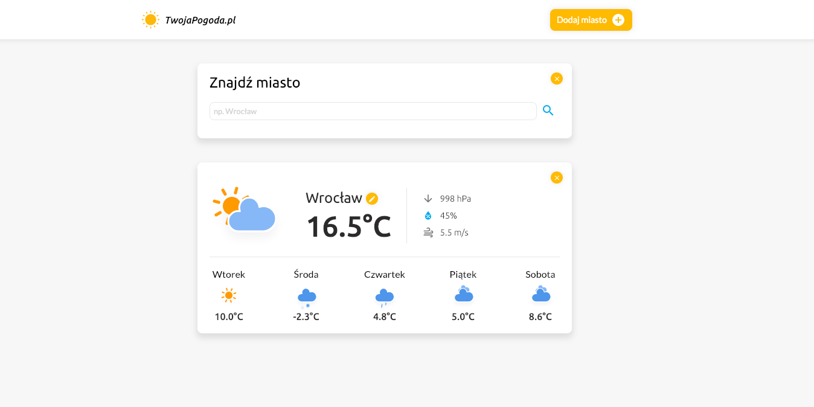

# Weather-App
Weather app on Coders Lab Java script course

## Ogólne informacje
Projekt jest prostą aplikacją służącą do wyszukiwania prognozy pogody. Został on wykonany w ramach kursu JavaScript w szkole programowania Coderslab. Po wejsciu na stronę zostaje pobrane IP użytkownika i automatycznie wyświetlana zostaje prognoza pogody dla miejsca, w którym się znajduje. Używkownik może również ręcznie dodać miasto o podanej przez siebie nazwie i wyszukać dla niego prognozę pogody. Każde nowo dodane miasto wyswietla się jako kolejny moduł, który można usunać klikając przycisk w prawym górnym rogu bądź zmodyfikować. W celu modyfikacji należy kliknąć na ikonkę koło nazwy miasta, skasować nazwę miasta i wpisać inną, a nastepnie zatwierdzić operację przyciskiem Enter. Wtedy pogoda w danym module zaktualizuje się i będzie zgodna z prognozami pogody dla nowo wpisanego miasta.

## Technologie
Projekt powstał przy użyciu
* JavaScript 1.7
* Node.js 12.13
* Npm 6.12.0
* Webpack

## Wykorzystane zagadnienia
W projekcie została wykorzystana wiedza z zakresu:
* funkcje wyższego rzędu
* funkcje strzałkowe
* import/export modułów ES6
* łańcuchy szblonowe
* Promises
* fetch
* funkcje asynchroniczne, wywoływanie promissów przy pomocy async/await

## Wykorzystane Api
Aplikacja pobiera informacje z następujacych Api:
* 'http://ip-api.com/ - pobieranie adresu IP urządzenia i na jego podtwaie określanie miejscowości w której sie znajduje oraz współrzędnych geogrefocznych
* https://api.openweathermap.org/ - na podstawie długosci i szerokości geograficznej określanie warunków pogodowych (temperatura, cisnienie, wilgotność prędkość wiatru itp.)
* https://graphhopper.com/api/ - na podstawie nazwy miasta określanie jego połozenia (długosci i szerokosci geograficznej)
